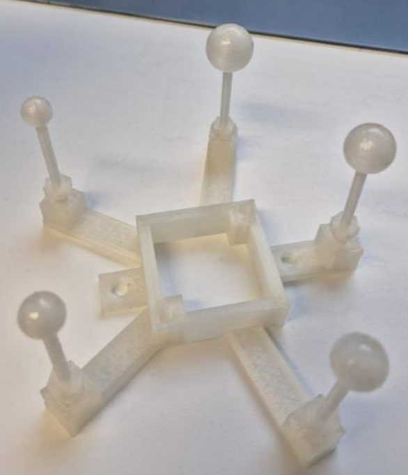
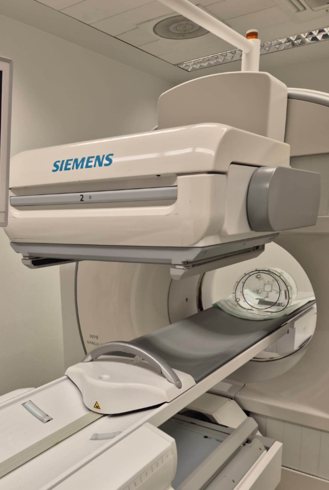
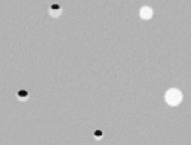
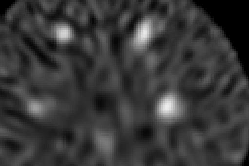
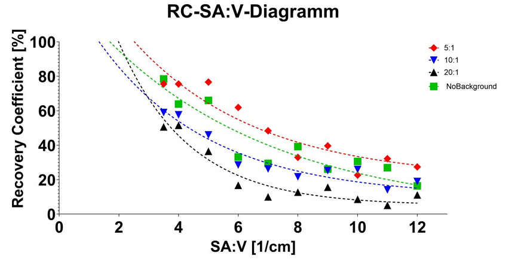

# 🔬 Partial Volume Effect (PVE) Analysis in SPECT/CT Imaging

---

This repository contains the documentation and core files from a research internship in medical technology. The project's primary focus was to analyze and quantify the **Partial Volume Effect (PVE)** in SPECT/CT imaging, a phenomenon that can lead to significant over- or underestimation of activity in small anatomical structures.

## ✨ Project Goal

---

The main objective was to investigate the relationship between an object's size and its measured activity in SPECT images. To achieve this, we manufactured and measured 3D-printed spherical phantoms, and we analyzed their **Recovery Coefficients (RC)** to understand the influence of the **Surface Area to Volume (SA:V) ratio** on the PVE. The ultimate goal is to enable better image quality through PVE correction in nuclear medicine diagnostics.

## 🛠️ Methodology & Approach

---

The project followed a structured approach, from phantom manufacturing to quantitative data analysis.

### Phantom Design and Manufacturing
* We designed and 3D-printed 10 hollow spherical phantoms with varying SA:V ratios using both **Fused Deposition Modeling (FDM)** and **Stereolithography (SLA)** techniques.
* To ensure watertightness and a smooth surface, the FDM-printed phantoms were post-processed through sanding and an epoxy resin coating.

  

  <em>Figure: 3D-printed hollow spheres with different Surface Area to Volume ratios</em>

### Measurement & Data Acquisition
* The phantoms were filled with a known activity of the **Technetium-99m** radioisotope.
* Measurements were conducted using a **SPECT/CT camera**, with multiple runs at different background activity levels to simulate real-world conditions (20:1, 10:1, and 5:1 activity ratios, as well as a no-background control).

  
   
  <em>Figure: Siemens SPECT/CT camera setup showing the container (water-filled) with five spheres placed inside for measurement.</em>

### Data Processing & Analysis
* We used a custom Python script for data processing. This script registered (resliced) the functional SPECT images to the anatomical CT images, ensuring that both datasets were perfectly aligned.
* The script then calculated the total activity and volume within segmented regions of interest, allowing us to determine the activity concentration and, subsequently, the **Recovery Coefficient (RC)** for each phantom.

  
  

  <em>CT vs. SPECT images of the phantom</em>

## 📈 Key Findings

---

Our results showed a clear, expected correlation:
* The **Recovery Coefficient decreases as the SA:V ratio increases**. This indicates that for smaller objects (higher SA:V ratio), the measured activity is a significantly lower fraction of the true activity.
* The PVE is a major factor in the quantitative analysis of SPECT images, especially for small objects.

The data also showed that the background activity level significantly impacts the measured RC values.

  
   
  <em>Figure: Recovery Coefficient decreases as SA:V ratio increases</em>

## 💬 Discussion & Challenges

---

We faced a number of manufacturing challenges, particularly with the FDM-printed phantoms. The print inaccuracies led to deviations between the calculated and measured volumes, and the rough internal surfaces caused air bubbles to form during filling, which impacted the accuracy of the measurements. These issues highlight the importance of high-precision manufacturing for such studies.

## 📁 Repository Contents

| File | Description |
|------|-------------|
| `README.md` | Main project documentation |
| `SPECT CT Matrix Converter and Readout (RH).ipynb` | Jupyter Notebook for matrix conversion and image readout |
| `ctpic.png` | Example CT image of phantom |
| `spectpic.png` | Example SPECT image of phantom |
| `spectct.jpg` | Photo of the Siemens SPECT/CT measurement setup |
| `graph.png` | Recovery Coefficient vs SA:V plot |
| `report.pdf` | Full internship report (available upon request) |
| `data_analysis_script.py` | Python script for reslicing images and RC calculation |
| `phantom_designs/` | STL files for spherical phantoms (available upon request) |

## ✅ Conclusion

---

This work confirms a strong relationship between the **surface area-to-volume ratio** and the **Partial Volume Effect**. By understanding and quantifying this effect, we can work toward improving PVE correction algorithms, which will lead to more accurate activity measurements and, ultimately, better image quality for diagnosis and therapy in nuclear medicine.

## Background & Related Work

📄 

📄 01202-4/fulltext)
